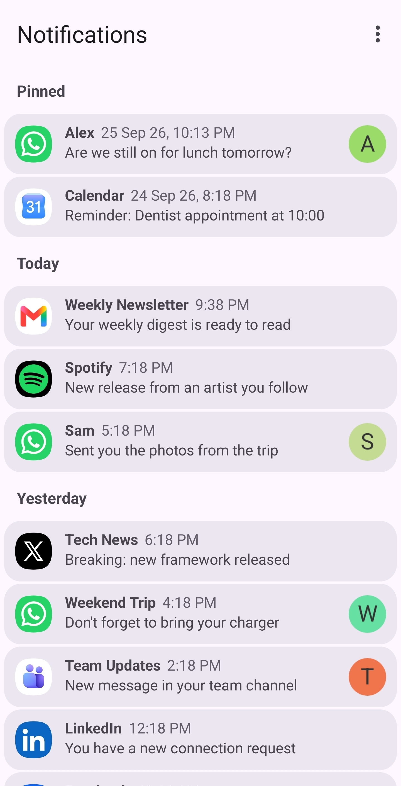
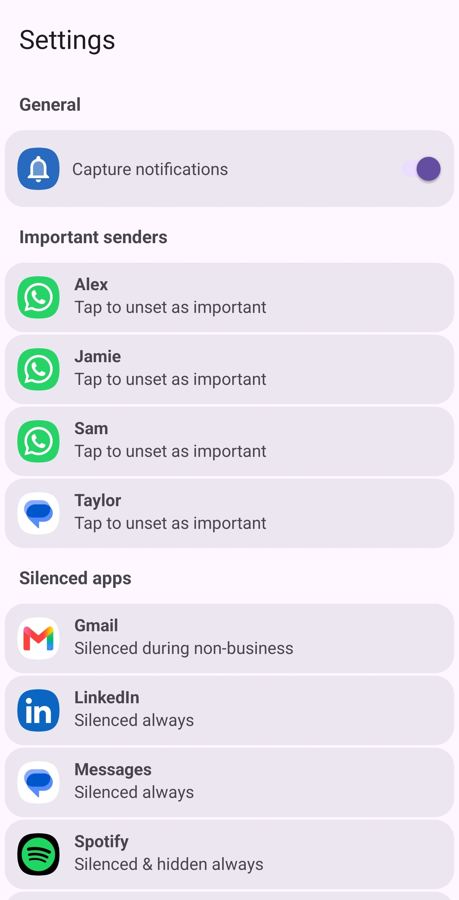
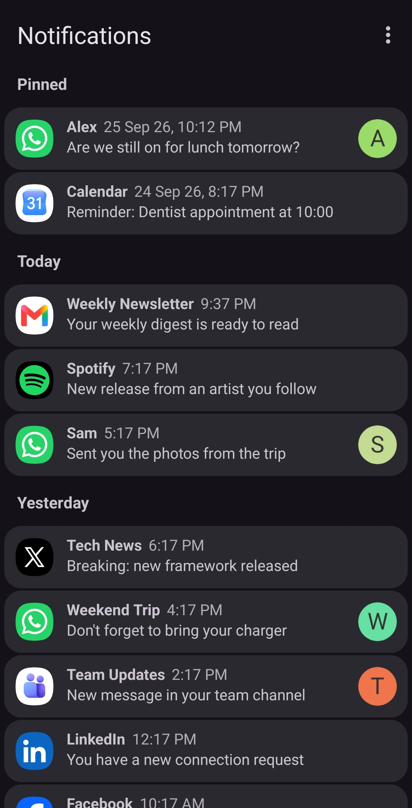
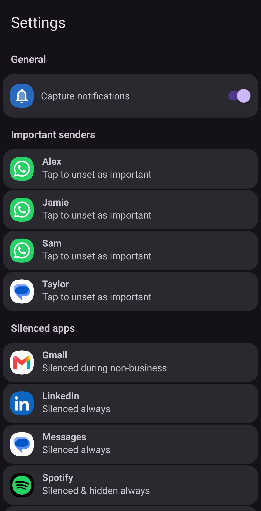

# Notifications

An Android app that captures, stores, and organizes the notifications posted by other apps on your device, so you can review, filter, and act on them even after the system tray dismisses them.

## Screenshots

| Notifications | Settings |
| --- | --- |
|  |  |
|  |  |

*Shown with sample data.*

## Features

- **Notification history** – captures notifications via a `NotificationListenerService` and stores them locally (Room/SQLite), including the sender's icon.
- **Pinning** – pin notifications to keep them from being cleared, and bulk-delete everything else.
- **Silencing** – silence notifications per app, either always or outside business hours.
- **Important senders** – mark specific senders as important so their notifications always come through regardless of silencing.
- **Grouping** – notifications are grouped by day (Today/Yesterday).
- **Copy actions** – quickly copy a notification's sender or message text.
- **Localization** – available in English and Spanish.

## Requirements

- Android 8.0 (API 26) or higher.
- Grant the "Notification access" permission (Settings → Notifications → Special app access) so the app can listen for notifications.

## Building

Open the project in Android Studio, or build from the command line:

```bash
./gradlew assembleDebug
```

## Privacy

All notification data is stored locally on the device (Room/SQLite); the app does not transmit data anywhere.